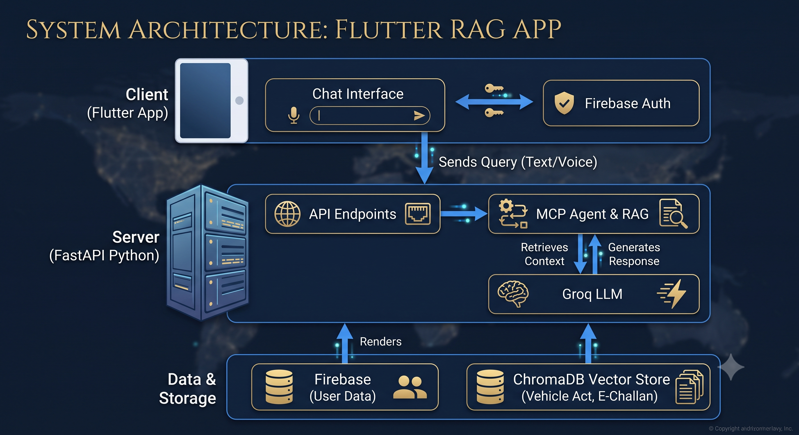

# TraffiX

**Quick Links:**
- [📌 Introduction](#-introduction)
- [✨ Features](#-features)
- [🏗️ Architecture](#️-architecture)
- [🛠️ Tech Stack](#️-tech-stack)
- [🚀 Getting Started](#-getting-started)
- [📖 API](#-api--integrations)
- [🤝 Contributing](#-contributing)

---

## 📌 Introduction
TraffiX is an AI-powered legal assistant and chatbot designed to help users understand traffic rules, regulations, and e-challan processes. By leveraging advanced Retrieval-Augmented Generation (RAG) and the Model Context Protocol (MCP), TraffiX provides accurate, context-aware answers based on official documents like the Vehicle Act and E-Challan user manuals. It features a cross-platform mobile app built with Flutter and a powerful API backend built with FastAPI.

## ✨ Features
- **🤖 AI Legal Assistant:** Ask complex questions about traffic laws and e-challans and get precise, contextual answers.
- **🎙️ Voice Input:** Integrated speech-to-text functionality for hands-free queries.
- **🌍 Multilingual Support:** Built-in translation services to make legal information accessible in various languages.
- **🔐 Secure Authentication:** Firebase-powered secure login and user data management.
- **💬 Rich Chat Interface:** Markdown support for structured answers, complete with WhatsApp-like sound effects and engaging animations.

## 🏗️ Architecture
TraffiX operates on a client-server architecture:



- **Client:** A Flutter mobile application that handles user authentication (Firebase), voice input, and UI rendering (markdown, animations).
- **Server:** A FastAPI Python backend that exposes endpoints for queries (`/ask`), translation (`/translate`), and conversation history. It integrates with LangChain, Groq, and ChromaDB to perform RAG over legal PDFs.

## 🛠️ Tech Stack
- **Frontend:** Flutter, Dart, Firebase Auth & Firestore, Speech-to-Text.
- **Backend:** Python, FastAPI, Uvicorn.
- **AI & ML:** LangChain, Groq, ChromaDB, Sentence Transformers, PyMuPDF (for document processing), Model Context Protocol (MCP).
- **Infrastructure:** Firebase (Auth/DB), Vector Store (Local ChromaDB).

## ⚙️ Workflow
1. **User Interaction:** The user inputs a query via text or voice in the Flutter app.
2. **API Request:** The app sends the query to the FastAPI backend's `/ask` endpoint.
3. **Information Retrieval:** The backend's agent uses ChromaDB to retrieve relevant sections from the Vehicle Act and E-Challan manuals.
4. **LLM Generation:** Groq processes the retrieved context and generates a precise legal answer.
5. **Response Rendering:** The text is returned to the app and rendered using `flutter_markdown` with satisfying UI animations and sound effects.

## 📂 Project Structure
```text
traffix/
├── Flutter/                  # Flutter mobile application
│   ├── lib/                  # Dart source code & UI screens
│   ├── assets/               # Sound files and images
│   ├── pubspec.yaml          # Flutter dependencies
│   └── firebase.json         # Firebase configuration
├── python_backend/           # FastAPI backend
│   ├── main.py               # API endpoints & application entry
│   ├── MCP/                  # Model Context Protocol agent implementation
│   ├── RAG/                  # Retrieval-Augmented Generation logic
│   ├── vector_store/         # ChromaDB local storage
│   ├── requirements.txt      # Python dependencies
│   └── *.pdf                 # Source documents (e.g., vehicle-act.pdf)
└── README.md                 # Project documentation
```

## 🚀 Getting Started

### Prerequisites
- [Flutter SDK](https://flutter.dev/docs/get-started/install) (v3.8+)
- [Python](https://www.python.org/downloads/) (v3.9+)
- Firebase Account (for setting up Firestore & Auth)

### Installation

#### 1. Backend Setup
```bash
cd python_backend
python -m venv .venv
source .venv/bin/activate  # On Windows use: .venv\Scripts\activate
pip install -r requirements.txt
```

#### 2. Frontend Setup
```bash
cd Flutter
flutter pub get
```

### Running the App

**Start the Backend:**
```bash
cd python_backend
uvicorn main:app --host localhost --port 8000 --reload
```

**Start the Flutter App:**
```bash
cd Flutter
flutter run
```

## 🔑 Environment Variables
Create a `.env` file in the `python_backend` directory with the following keys:
```env
GROQ_API_KEY=your_groq_api_key_here
# Add any other necessary keys here
```

## 📖 API / Integrations
The FastAPI backend exposes the following key endpoints:
- `POST /ask` - Submit a legal question and receive an AI-generated answer.
- `POST /translate` - Translate text to a target language.
- `GET /history` - Retrieve the current conversation history.
- `POST /clear` - Clear the context and history.
- `GET /tools` - Get a list of available MCP tools.
- `GET /health` - Check API and agent status.

## 💡 Use Cases
- **Traffic Rule Clarification:** "What is the penalty for jumping a red light under the new Vehicle Act?"
- **E-Challan Navigation:** "How do I pay an e-challan online?"
- **Multilingual Support:** "Translate the penalty rules for speeding into Hindi."

## 🔮 Future Improvements
- [ ] Add more state-specific traffic rules to the vector database.
- [ ] Implement user profiles to save past e-challan queries.
- [ ] Integrate a payment gateway sandbox to simulate e-challan payments.

## 🤝 Contributing
Contributions are welcome! Please follow these steps:
1. Fork the repository
2. Create a new branch (`git checkout -b feature/AmazingFeature`)
3. Commit your changes (`git commit -m 'Add some AmazingFeature'`)
4. Push to the branch (`git push origin feature/AmazingFeature`)
5. Open a Pull Request

## 📄 License
This project is licensed under the MIT License - see the [LICENSE](./LICENSE) file for details.
